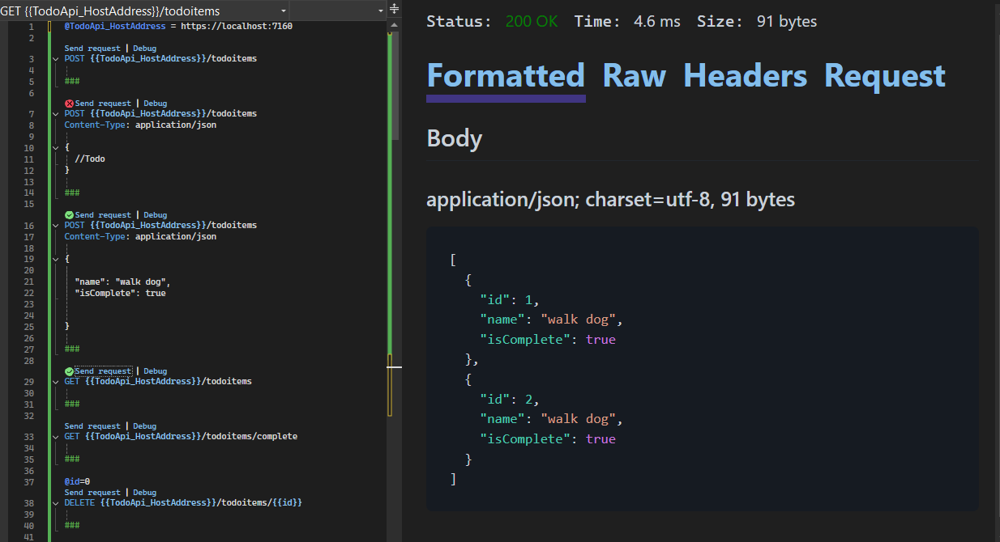
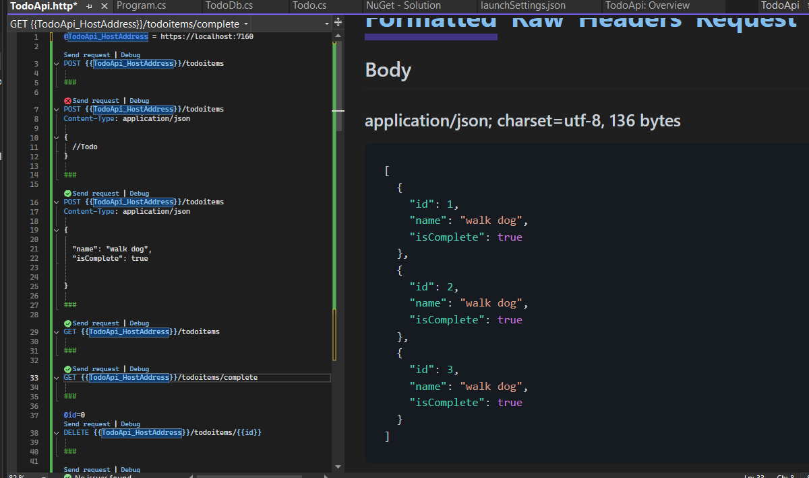
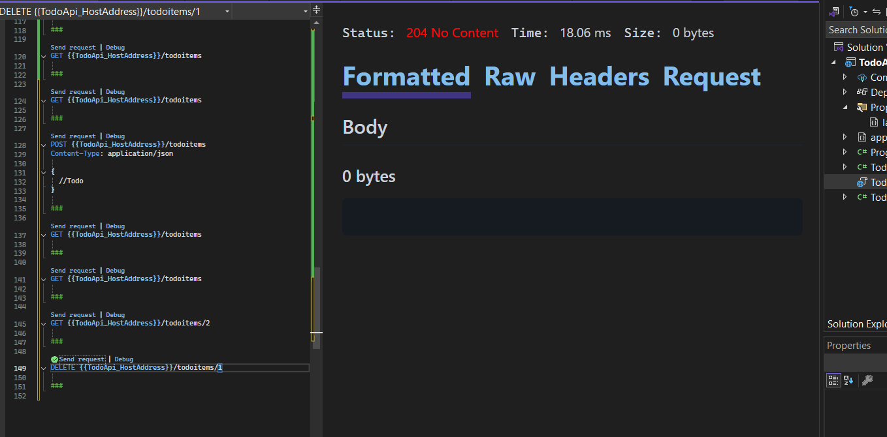
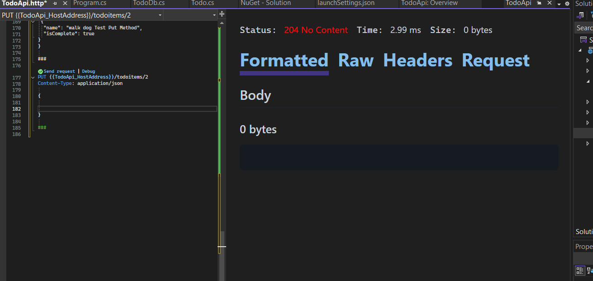

# Kết quả đạt được 
## Tổng quan dự án 
Dự án này là một API đơn giản thực hiện các thao tác CRUD (Create, Read, Update, Delete) để quản lý danh sách các mục "todo". API sử dụng **Entity Framework Core** với **Cơ sở dữ liệu In-Memory** để lưu trữ dữ liệu.

## Các tính năng chính:

1. **Tạo mục Todo** (`POST /todoitems`)
   - Cho phép người dùng thêm một mục todo mới.
   - Mục todo mới được thêm vào cơ sở dữ liệu In-Memory.

2. **Lấy tất cả các mục Todo** (`GET /todoitems`)
   - Lấy tất cả các mục todo từ cơ sở dữ liệu.
   - Trả về danh sách tất cả các mục todo trong phản hồi.

3. **Lấy các mục Todo đã hoàn thành** (`GET /todoitems/complete`)
   - Lấy các mục todo chỉ có trạng thái đã hoàn thành (`IsComplete = true`).
   - Trả về danh sách các mục todo đã hoàn thành.

4. **Lấy mục Todo theo ID** (`GET /todoitems/{id}`)
   - Lấy mục todo cụ thể theo ID.
   - Nếu mục tồn tại, trả về mục todo; nếu không, trả về phản hồi `404 Not Found`.

5. **Cập nhật mục Todo** (`PUT /todoitems/{id}`)
   - Cập nhật mục todo đã có theo ID.
   - Nếu mục tồn tại, cập nhật các thuộc tính `Name` và `IsComplete`; nếu không, trả về phản hồi `404 Not Found`.

6. **Xóa mục Todo** (`DELETE /todoitems/{id}`)
   - Xóa mục todo cụ thể theo ID.
   - Nếu mục tồn tại, nó sẽ bị xóa khỏi cơ sở dữ liệu; nếu không, trả về phản hồi `404 Not Found`.

## Cơ sở dữ liệu:

- API sử dụng **Entity Framework Core** với **Cơ sở dữ liệu In-Memory** để lưu trữ các mục todo.
- Cơ sở dữ liệu được cấu hình qua `builder.Services.AddDbContext<TodoDb>(opt => opt.UseInMemoryDatabase("TodoList"))`.

## Mô hình dữ liệu:

- **Mô hình Todo**:
    - `Id`: Số nguyên, khóa chính của mục todo.
    - `Name`: Chuỗi, tên hoặc mô tả của mục todo.
    - `IsComplete`: Boolean, chỉ ra mục todo đã hoàn thành hay chưa.

## Endpoints API:

| Phương thức | Endpoint                  | Mô tả                                                                   |
|-------------|---------------------------|-------------------------------------------------------------------------|
| `GET`       | `/todoitems`               | Lấy tất cả các mục todo.                                                |
| `GET`       | `/todoitems/complete`      | Lấy tất cả các mục todo đã hoàn thành.                                  |
| `GET`       | `/todoitems/{id}`          | Lấy mục todo cụ thể theo ID.                                            |
| `POST`      | `/todoitems`               | Tạo một mục todo mới.                                                   |
| `PUT`       | `/todoitems/{id}`          | Cập nhật mục todo theo ID.                                             |
| `DELETE`    | `/todoitems/{id}`          | Xóa mục todo theo ID.                                                  |

## Các bước đã kiểm tra API:

1. Lấy danh sách tất cả công việc (GET)
- URL: http://localhost:7160/todoitems
  
2. Thêm một công việc mới (POST)
  - URL: http://localhost:7160/todoitems
     
`
Body: 
{
  "name": "walk dog 3",
  "isComplete": true
}  `

3. Lấy danh sách công việc hoàn thành (GET)
  - URL: http://localhost:7160/todoitems/complete  

4. Xóa một công việc (DELETE)

  - URL: http://localhost:7160/todoitems/1

  
5. Lấy thông tin chi tiết một công việc (GET)
- URL: http://localhost:7160/todoitems/2
   
6. Cập nhật thông tin công việc (PUT)
- URL: http://localhost:7160/todoitems/2
 
